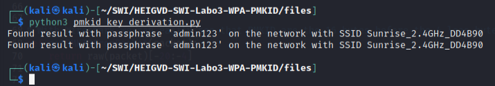
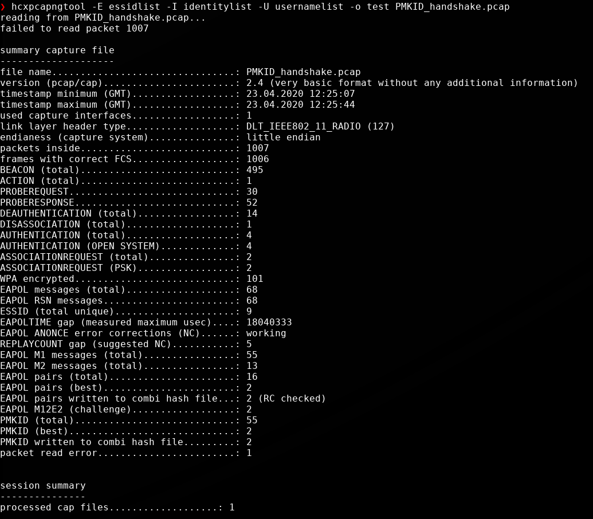
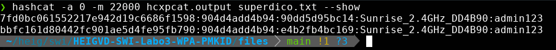

- [Livrables](#livrables)

- [Échéance](#échéance)

- [Travail à réaliser](#travail-à-réaliser)

# Sécurité des réseaux sans fil

## Laboratoire WPA - PMKID

__A faire en équipes de deux personnes__

__Développement à faire en Python 3__

### Pour cette partie pratique, vous devez être capable de :

* A partir d’une capture Wireshark, extraire la valeur de la PMKID utilisant Scapy
* Ecrire un script Python pour Cracker la passphrase WPA utilisant la PMKID

Pour l'explication de l'attaque, référez vous à la video suivante :

[](http://www.youtube.com/watch?v=APkk9C2sydM "PMKID attack")


## Travail à réaliser

### 1. Obtention de la PMKID et des paramètres pour la dérivation de la PMK  

Dans cette première partie, vous allez réutiliser le script de dérivation de clés que vous avez rendu pour le [labo WPA](https://github.com/arubinst/HEIGVD-SWI-Labo2-WPA). Il vous faudra également le fichier de capture [PMKID_handshake.pcap](files/PMKID_handshake.pcap) contenant une tentative d’authentification WPA pas réussie réalisée par un attaquant.

La PMKID est contenue dans le premier message du 4-way handshake de certains AP. Les AP de l'opérateur Sunrise en Suisse, par exemple, sont confirmés comme étant vulnérables. Il s'agit donc d'un AP de Sunrise qui a été utilisé pour faire [la capture](files/PMKID_handshake.pcap). 

Voici ce que vous devez faire pour cette première partie :

- __Modifier votre script WPA__ pour qu’il récupère automatiquement, à partir de la capture, la valeur de la PMKID
- Vous aurez aussi besoin de récupérer les valeurs du ```ssid```, ```APmac``` et ```Clientmac``` (ceci est normalement déjà fait par votre script) 


### 2. Cracker la Passphrase utilisant l'attaque PMKID

L'attaque PMKID est une attaque par dictionnaire qui calcule systématiquement une PMK à partir de la passphrase. Cette PMK est utilisée comme clé pour SHA-1 calculé sur une concatenation du string "PMK Name" et les adresses MAC de l'AP et la STA. Les premiers 128 bits (6 octets) du résultat de ce calcul doivent correspondre à la valeur de la PMKID obtenue à partir du premier message du 4-way handshake.

Utilisant votre script précédent, le modifier pour réaliser les taches suivantes :

- Lire une passphrase à partir d’un fichier (wordlist) &rarr; __La passphrase utilisée dans la capture est ```admin123```__
- Dériver la PMK à partir de la passphrase que vous venez de lire et des autres éléments nécessaires contenus dans la capture (cf [exercice 1](#1-obtention-de-la-pmkid-et-des-paramètres-pour-la-dérivation-de-la-pmk))
- Calculer la PMKID (cf [vidéo YouTube](http://www.youtube.com/watch?v=APkk9C2sydM))
- Comparer la PMKID calculée avec celle récupérée de la capture :
   - Identiques &rarr; La passphrase utilisée est correcte
   - Différents &rarr; Essayer avec une nouvelle passphrase




La passphrase de l'AP `Sunrise_2.4GHz_DD4B90` apparaît ici deux fois car il y a 2 association requests et 2 handshakes avec chacun un client différent. Le meilleur endroit pour filtrer les réseaux avec une passphrase trouvée serait dans notre boucle du main, mais il nous faudrait un dictionnaire contenant le SSID, l'adresse MAC de l'AP ainsi que la passhprase trouvée. Vu la petite taille de notre dictionnaire ceci n'est pas nécessaire.

Nous ne pouvons pas élimminer une des deux association requests basée sur le SSID et l'adresse MAC de l'AP car un client peut ne pas avoir commencée le handshake au moment oũ la capture a été effectuée.


### 3. Attaque hashcat

A manière de comparaison, réaliser l'attaque sur le [fichier de capture](files/PMKID_handshake.pcap) utilisant la méthode décrite [ici](https://hashcat.net/forum/thread-7717.html).

Nous possédons déjà le fichier de capture, nous allons donc ignorer la première étape de la procédure et passer directement à la conversion de ce fichier en quelque chose qui peut être lu par `hashcat`.

Pour cela nous avons exécuté la commande : ` hcxpcapngtool -E essidlist -I identitylist -U usernamelist -o output PMKID_handshake.pcap`, les paramètres `-E`, `-I` et `-U` ne sont pas nécessairement utiles dans notre cas mais nous permettent d'examiner s'ils produisent des résultats. Pour nous, cela produit une liste `essidlist` principalement, ce qui peut être intéressant dans d'autres cas de figure.



Ensuite on va utiliser `hashcat` pour attaquer le fichier à l'aide de notre dictionnaire. Nous allons devoir selectionner un mode d'attaque, nous reperons les points qui nous intéressent dans la documentation.

```
22000 | WPA-PBKDF2-PMKID+EAPOL                           | Network Protocols
22001 | WPA-PMK-PMKID+EAPOL                              | Network Protocols
```

Nous allons donc exécuter `hashcat -a 0 -m 22000 hcxpcat.output superdico.txt` et nous constatons qu'il nous récupère la clé `admin123` correctement et très rapidement. L'avantage d'utiliser `hashcat` plutôt que notre script personnalisé serait de gagner du temps sur une grande liste à tester (ici notre dictionnaire est bien trop petit pour voir une différence) ainsi que de permettre des attaques dictionnaires + règles.

 


## Livrables

Un fork du repo original . Puis, un Pull Request contenant **vos noms** et :

- Script ```pmkid_attack.py``` **abondamment commenté/documenté** + fichier wordlist
   - Capture d’écran de votre script en action
- Captures d'écran de votre exercice 3
-	Envoyer le hash du commit et votre username GitHub et **les noms des participants** par email au professeur et à l'assistant


## Échéance

Le 06 mai 2021 à 23h59